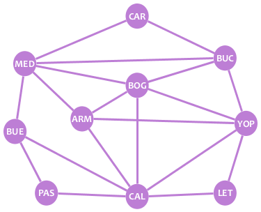
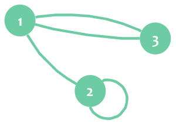

# ¡Te doy la bienvenida!

Este *playground* corto te dará algunas bases de teoría de grafos: qué son los grafos, nodos y aristas, y cómo pueden usarse para modelar información y resolver problemas.

¿Te gustaría añadir añadiendo contenido o corrigiendo errores? [¡Encuentra este *playground* en Github!](https://github.com/Racso/playground-eZSNYBkF)

# Prerrequisitos
* Ninguno.

# Grafos, nodos y aristas

Mira la siguiente imagen:

La imagen representa algunas ciudades colombianas: Cartagena, Bucaramanga, Medellín, Bogotá y otras. Cada círculo es una ciudad. Las líneas conectando los círculos representan vuelos comerciales que puedes tomar entre ciudades. Por ejemplo, puedes volar de Bucaramanga (BUC) a Bogotá (BOG), pues esas ciudades están conectadas con una línea, pero no puedes volar de Pasto (PAS) a Leticia (LET) porque no están conectadas.

Sencillo, ¿no? Pues buen, ese es un grafo, y los grafos son fáciles de entender. Los **grafos** son estructuras que nos permiten modelar relaciones entre elementos. En este caso, usamos un grafo para modelar conexiones aéreas entre ciudades.

Los grafos se componen de dos tipos de elemento:
1. **Vértices o nodos**, que representan elementos. En la imagen, los círculos son los nodos, y cada nodo representa una ciudad.
2. **Aristas**, que representan relaciones entre elementos. En la imagen, las líneas son las aristas, cada una representando una conexión aérea entre dos ciudades.

Cada arista conecta exactamente dos nodos. Esto significa que nunca encontrarás una arista con un lado apuntando hacia la nada.

Se dice que dos nodos son vecinos si hay una arista conectándolos. En el ejemplo, Bucaramanga (BUC) y Bogotá (BOG) son vecinos, pero Pasto (PAS) y Leticia (LET) no lo son.

?[¿Cuántos vecinos tiene el nodo BUC?]
-[ ] 3
-[ ] 6
-[x] 4
-[ ] 5

Un grafo puede dibujarse de diferentes formas sin cambiarlo. Dónde y cómo se dibujen los nodos y las aristas de un grafo no importa; lo que importa es qué nodos contiene el grafo y cómo están conectados entre ellos. Por ejemplo, podemos redibujar nuestro grafo de ciudades de la siguiente forma, sin cambiarlo:

Con base en un grafo, puedes calcular fácilmente cosas acerca de la situación que estás modelando. Para grafos pequeños, puedes hacerlo a mano. Para grafos mayores, puedes crear programas simples o utilizar algoritmos conocidos para abordar el problema. Intenta resolver las siguientes preguntas acerca de nuestro grafo de ciudades:

?[¿Cuántas ciudades hay?]
-[x] 10
-[ ] 9
-[ ] 8
-[ ] 11

?[Si quisiera ir desde Cartagena (CAR) hasta Pasto (PAS), ¿cuál es la cantidad MÍNIMA de vuelos que tendría que tomar?]
-[x] 3
-[ ] 2
-[ ] 4
-[ ] 5

# Ciclos y aristas paralelas

Nuestro grafo de ciudades es un **grafo simple**, dado que no tiene **"ciclos"** ni **"aristas paralelas"**. Vamos a ver qué son esos.

El siguiente grafo **no** es un grafo simple:

En este grafo, hay una arista que conecta al nodo 2 consigo mismo. Esa arista es un ciclo. En otras palabras, un **ciclo o bucle** es una arista que empieza y termina en el mismo nodo. El nodo está conectado consigo mismo, de modo que es su propio vecino.

También puedes ver que los nodos 1 y 3 están conectados por dos aristas. Esas aristas son "paralelas". En otras palabras, varias aristas son **aristas paralelas** si conectan el mismo par de nodos.

Los ciclos y las aristas paralelas son útiles en ciertas aplicaciones específicas. Sin embargo, para muchas aplicaciones del mundo real (quizá la mayoría de ellas), no querrás tener ciclos ni aristas paralelas en tus grafos. A un grafo que no tiene ciclos ni aristas paralelas se le llama **grafo simple**.

# El grado de un nodo
El **grado** de un nodo es la cantidad de aristas que inciden en él. Una arista "incide" en un nodo si lo conecta con otro nodo (o consigo mismo, en el caso de un bucle). Dicho de otro modo: una arista incide en un nodo si lo "toca" con uno de sus dos lados.

En un grafo simple, el grado de un nodo es igual a la cantidad de vecinos que éste tiene. En contraste, cuando un nodo tiene un ciclo, el ciclo añade 2 al grado del nodo.

En nuestro grafo no simple del ejemplo anterior, los grados de los nodos son los siguientes:
* deg(**1**) = 3
* deg(**2**) = 3 (recuerda: el ciclo añade 2)
* deg(**3**) = 2

# Grafos dirigidos

Let's suppose we want to model some Twitter users with a graph. This is the information about the users:

- Alice (A) follows Bob and Carol.
- Bob (B) follows Alice.
- Carol (C) follows Bob.

OK, cool. We can model people as nodes and "follows" as edges. However, this time we have an extra ingredient: direction.

In Twitter, following a person goes in one direction: you may follow one person, but that person may or may not follow you back. In our example, Carol follows Bob, but Bob doesn't follow Carol back. Something similar happens with personal relationships in real life: you may like a person, but that person may or may not like you back.

Is because of this asymmetry that our graph needs a way to convey who follows whom. This is done with **directed edges**:

Directed edges look like arrows. They have a starting node and an ending node.

Our directed graph easily shows us some information about our users. For example, it's clear that Alice and Bob follow each other, and that Bob is the person with the most followers (because two arrows point to B).
