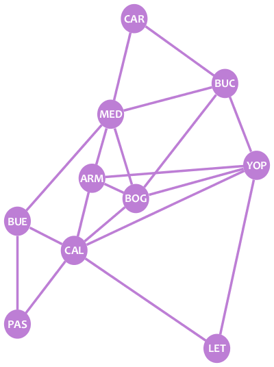

Ya sabemos qué son los grafos. Ahora, veamos cómo podemos representar grafos de otros modos además de dibujarlos. Ello será útil si queremos trabajar con grafos con un computador.

# Lista de adyacencia

¿Recuerdas nuestro grafo de ciudades?

Hagamos una lista de los vecinos de cada nodo:

* **CAR:** MED, BUC
* **MED:** CAR, BUC, BUE, ARM, BOG
* **BUC:** CAR, MED, BOG, YOP
* **BUE:** MED, CAL, PAS
* **ARM:** MED, BOG, CAL
* **BOG:** MED, BUC, YOP, ARM, CAL
* **YOP:** BUC, ARM, BOG, LET
* **CAL:** BUE, ARM, BOG, YOP, LET, PAS
* **PAS:** BUE, CAL
* **LET:** CAL, YOP

Esa es la **lista de adyacencia** del grafo: una lista de listas describiendo los vecinos de cada nodo.

Si el grafo es dirigido, un nodo B sólo aparece en la lista de un nodo A si hay una arista desde A hacia B. Por ejemplo, en nuestro grafo dirigido de Twitter:

* **A:** B, C
* **B:** A
* **C:** B

# Matriz de adyacencia

Los grafos también pueden representarse con **matrices de adyacencia**. Aquí está la matriz de adyacencia de nuestro grafo de ciudades:

|	|CAR	|BUC	|YOP	|BOG	|LET	|CAL	|ARM	|MED	|BUE	|PAS    |
|---	|---	|---	|---	|---	|---	|---	|---	|---	|---	|---    |
|**CAR**|0	|1	|0	|0	|0	|0	|0	|1	|0	|0      |
|**BUC**|1	|0	|1	|1	|0	|0	|0	|1	|0	|0      |
|**YOP**|0	|1	|0	|1	|1	|1	|1	|0	|0	|0      |
|**BOG**|0	|1	|1	|0	|0	|1	|1	|1	|0	|0      |
|**LET**|0	|0	|1	|0	|0	|1	|0	|0	|0	|0      |
|**CAL**|0	|0	|1	|1	|1	|0	|1	|0	|1	|1      |
|**ARM**|0	|0	|1	|1	|0	|1	|0	|1	|0	|0      |
|**MED**|1	|1	|0	|1	|0	|0	|1	|0	|1	|0      |
|**BUE**|0	|0	|0	|0	|0	|1	|0	|1	|0	|1      |
|**PAS**|0	|0	|0	|0	|0	|1	|0	|0	|1	|0      |

Adjacency matrices have the graph nodes in both their rows and columns. The value on each cell shows if there exists an edge between the pair of nodes of the corresponding row and column. For example, the cell in row **BOG** and column **BUC** has a value of **1** because there is an edge between BOG and BUC, whereas the cell in row **PAS** and column **YOP** has a **0** because there's no edge between those two nodes.

A graph may have several adjacency matrices. In the example above, if you put the nodes in a different order, you'll have a new adjacency matrix of the same graph.

As you may check, if a graph is undirected, its adjacency matrices are symmetrical. On the other side, if the graph is directed, the matrices are not symmetrical, as a 1 only appears in a cell if there's an edge from the node of the row to the node of the column. For example, the following is the adjacency matrix of our Twitter graph:

|   | A | B | C |
|---|---|---|---|
|**A**|0|1|1|
|**B**|1|0|0|
|**C**|0|1|0|

# Exercise
The shown Python function is used for obtaining some information about a given graph. The graph is passed to the function as an adjacency list, and the function returns the maximum degree of a node of the graph, the amount of loops in the graph and a boolean indicating whether the graph has parallel edges or not.

Fix the function so it returns the desired information. You may assume that the graph will at most have 5 nodes, numbered from 1 to 5.

@[The shown function should return some information about a given graph. Fix it so it does it correctly.]({"stubs": ["graphs.py"], "command": "python3 test_graphs.py"})

# Ending
Congratulations! Now you have some fundamentals about graph theory. Now, you may learn more concepts abouth graphs, or start to learn some useful algorithms to apply them. The choice is yours!
